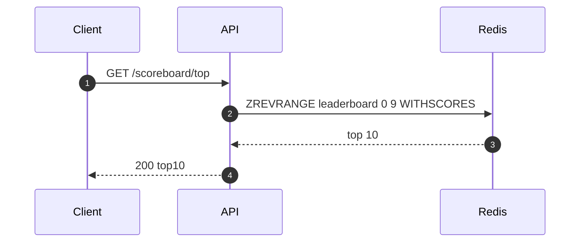
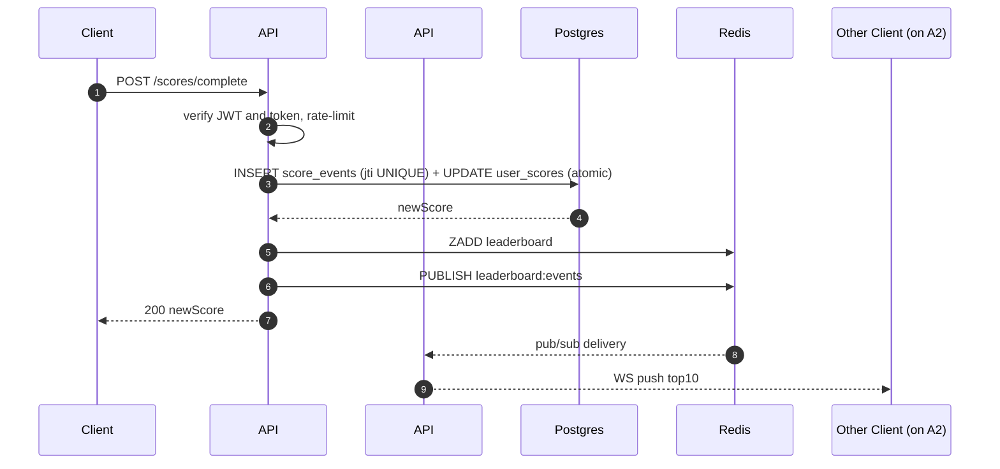

# Scoreboard Module — Architecture

Expands [§2 of the README](README.md#2-architecture) with the detail a backend team needs to build, deploy, and operate the module.

1. [System context](#1-system-context)
2. [Deployment topology](#2-deployment-topology)
3. [Read & write paths](#3-read--write-paths)
4. [Storage](#4-storage)
5. [Realtime fanout](#5-realtime-fanout)
6. [Failure modes](#6-failure-modes)
7. [Scaling notes](#7-scaling-notes)
8. [Observability](#8-observability)

---

## 1. System context

```
   Web Client ──HTTPS/WSS──► API Service (this module)
                                 │
                                 ├──► Postgres   (source of truth)
                                 └──► Redis      (ZSET + Pub/Sub)

   Auth Service     ── issues JWTs the API Service verifies
   User Service     ── canonical displayName lookup
```

The module **owns**: `user_scores`, `score_events`, the `leaderboard` ZSET, the action-token signing key.
The module **consumes**: JWTs from Auth Service, display names from User Service.

---

## 2. Deployment topology

```
                   ┌──────────────── Load Balancer ────────────────┐
                   │            (TLS termination, WS upgrade)       │
                   └───┬───────────────────┬───────────────────┬────┘
                       ▼                   ▼                   ▼
                 ┌──────────┐        ┌──────────┐        ┌──────────┐
                 │ API #1   │        │ API #2   │  ...   │ API #N   │
                 └────┬─────┘        └────┬─────┘        └────┬─────┘
                      │                   │                   │
                      └─────┬─────────────┴─────────┬─────────┘
                            ▼                       ▼
                     ┌──────────────┐       ┌──────────────┐
                     │  Postgres    │       │    Redis     │
                     │ primary +    │       │ ZSET +       │
                     │ read replica │       │ Pub/Sub      │
                     └──────────────┘       └──────────────┘
```

- **API instances are stateless.** Any request — including WebSocket upgrades — can land on any instance. No session affinity needed; cross-instance fanout via Redis pub/sub (§5) makes this safe.
- The **LB must support WebSocket upgrades** with idle timeout ≥ 60 s (so heartbeats keep the connection alive).
- **Postgres** runs primary + replica. Writes go to primary; reads almost always hit Redis first.

---

## 3. Read & write paths

### 3.1 Read — `GET /scoreboard/top`



Display names are hydrated from a small in-process LRU cache (60 s TTL), not from User Service on every request.

### 3.2 Write — `POST /scores/complete` with multi-instance fanout



Three load-bearing properties:

1. **Postgres before Redis.** If Redis dies after the commit, the reconciler (§6) re-hydrates the ZSET from Postgres. The reverse order would lose data.
2. **One transaction.** `INSERT score_events` and `UPDATE user_scores` succeed or fail together. The `UNIQUE(action_token_id)` violation rolls back the score change too.
3. **Writer ≠ broadcaster.** Pub/sub delivers to every instance, so the user who triggered the change and the user who sees the update don't have to be on the same instance.

---

## 4. Storage

### 4.1 Postgres

`user_scores` and `score_events` are defined in [§3 of the README](README.md#3-data-model). Production additions:

- **Partition `score_events` by month.** It grows linearly with traffic; partitioning keeps indexes small and lets us archive cold data without `DELETE`.
- **Index `(user_id, created_at DESC)` on `score_events`** for per-user audit queries.
- The `UNIQUE(action_token_id)` constraint is the **primary anti-replay control** — must remain enforced regardless of partitioning.

### 4.2 Redis keyspace

| Key | Type | Purpose |
|---|---|---|
| `leaderboard` | ZSET | Global Top-N, member = `userId`, score = score |
| `leaderboard:events` | Pub/Sub channel | Cross-instance broadcast |
| `rate:score:<userId>` | Token bucket | Per-user rate limit (60 s window) |
| `display:<userId>` | String | Optional display-name cache (60 s TTL) |

The ZSET is the only key that must survive a Redis restart. Either enable AOF persistence, or rely on the reconciler (§6) to rebuild it from Postgres on cold start.

---

## 5. Realtime fanout

### 5.1 Why fanout exists

A WebSocket is **stateful and process-local**. It lives in the memory of one specific API instance — only that process holds the file descriptor and can write bytes to that browser. No other instance can reach it.

This collides with the deployment topology. We run multiple instances for scale and redundancy, and the load balancer spreads requests across them. So when User A scores a point and their `POST /scores/complete` lands on instance #1, the *audience* for that update — every browser watching the scoreboard — is scattered across instances #1, #2, …, #N. Instance #1 has no way to reach the sockets held by the others.

```
                User A scores                       User B watches
                      │                                     │
                      ▼                                     ▼
                 ┌──────────┐                          ┌──────────┐
                 │ API #1   │  ── ??? ── can't reach ──│ API #2   │
                 │ (writes) │                          │ (holds   │
                 │          │                          │  B's WS) │
                 └──────────┘                          └──────────┘
```

Redis Pub/Sub is the bridge: instance #1 publishes one message, every instance receives it, each pushes to its own local sockets. The writer never has to know where any client is connected.

### 5.2 Why not something simpler

| Option | Why we don't |
|---|---|
| Single API instance | No horizontal scaling, no redundancy, every restart disconnects everyone. |
| Sticky sessions on WS | Doesn't help — the writer and the watchers are different users; you can't pin them to the same instance. |
| Direct mesh between instances | N² connections, peer discovery becomes our problem, deploys get messy. |
| Drop WS and poll instead | Defeats the live-update requirement and burns load when nothing has changed. |

### 5.3 How it works in practice

Each API instance subscribes to `leaderboard:events` **once**, regardless of how many WebSockets it holds. On each event it iterates its local socket map and pushes.

Cost per event:

```
O(API instances)          pub/sub delivery
+ O(sockets per instance) local push
```

There is **no per-event cost proportional to the total number of clients across the fleet**. Adding instances scales WS capacity linearly without making pub/sub the bottleneck.

### 5.4 Instance state and recovery

Per-instance state is just an in-memory `Map<socketId, ws>`. There is nothing to checkpoint and nothing to migrate.

When an instance dies, the OS closes its sockets; affected browsers reconnect through the LB and land on a surviving instance. The new instance is *already* subscribed to `leaderboard:events`, so the reconnected client starts receiving updates immediately — no reattachment logic, no peer-to-peer handoff, no consistent-hashing of users to instances.

This is the property that makes the API tier safely stateless even though WebSockets are intrinsically stateful: the state is **disposable**.

---

## 6. Failure modes

| Failure | Effect | Recovery |
|---|---|---|
| API instance crashes | WS clients reconnect elsewhere; HTTP retries | Orchestrator replaces instance |
| Postgres primary down | `/scores/complete` → 503; reads still work via Redis | Failover to replica |
| Redis down | Writes still commit to Postgres; live updates pause; `/scoreboard/top` falls back to Postgres `ORDER BY score DESC LIMIT 10` | Restart Redis; reconciler rebuilds ZSET |
| Action-token key compromised | Issued tokens valid until rotated | Rotate; 60 s TTL bounds the blast radius |

**Reconciler.** A periodic job (and on Redis-reconnect) that rebuilds the ZSET:

```ts
const rows = await db.query(
  'SELECT user_id, score FROM user_scores ORDER BY score DESC LIMIT 10000',
);
await redis.del('leaderboard');
await redis.zadd('leaderboard', ...rows.flatMap(r => [r.score, r.user_id]));
```

---

## 7. Scaling notes

| Scale | First bottleneck | Mitigation |
|---|---|---|
| ≤ 10k DAU | none | single instance is enough |
| 10k–100k DAU | API CPU under WS load | add API instances |
| 100k–1M DAU | Postgres write throughput | partitioning is in place; batch writes via queue if QPS > ~5k |
| ≥ 1M DAU | Single ZSET write throughput | shard by region or pre-aggregate |

`ZREVRANGE 0 9` is independent of leaderboard size — the read path has no scaling bottleneck within any realistic horizon.

---

## 8. Observability

**Metrics**

- `score_complete_requests_total{result}` — counter (ok / replay / expired / rate_limited / …).
- `score_complete_latency_seconds` — histogram, p95 SLO < 200 ms.
- `leaderboard_broadcast_latency_seconds` — DB commit → local WS send.
- `ws_connections` — gauge.
- `redis_zset_drift` — periodic diff of `user_scores` vs ZSET; non-zero means reconciler has work.

**Logs.** Structured JSON. Per request: `userId`, `route`, `status`, `latencyMs`, `actionTokenJti`. **Never log the JWT or the raw action token.**

**Alerts (suggested).**

- p95 `/scores/complete` > 500 ms for 5 min — page.
- `redis_zset_drift > 0` for 10 min — ticket.
- `ws_connections` drops by > 30 % in 1 min — page.
- Replay-rejection spike — routes to abuse-review queue, not pager.
