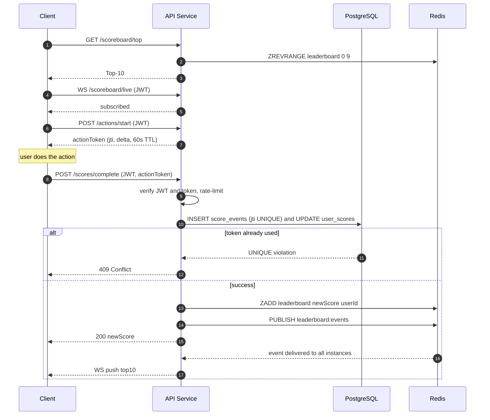

# Scoreboard Module — Backend Specification

## 1. Overview

A backend module for the API service that:

1. Receives score-increment requests when a user completes an action.
2. Maintains a **Top-10** leaderboard.
3. **Pushes live updates** to connected clients.
4. **Prevents users from increasing scores without authorisation.**

The "action" itself is out of scope — this module trusts a token issued when the action starts.

---

## 2. Architecture

```
Client ──HTTP──► API Service ──► PostgreSQL  (scores: source of truth)
                     │
                     └────────► Redis ZSET   (Top-10 cache)
                     │
                     └────────► Redis Pub/Sub ──► WS broadcast to clients
```

- **PostgreSQL** — durable score storage + audit log.
- **Redis ZSET** — `O(log N)` Top-10 reads.
- **Redis Pub/Sub** — fan-out across API instances so every WS client gets the update.

> Detailed architecture — deployment topology, internal layering, request paths, storage layout, failure modes, scaling, security boundaries, observability — lives in [ARCHITECTURE.md](ARCHITECTURE.md).

---

## 3. Data Model

**`user_scores`**

| Column | Type | Notes |
|---|---|---|
| `user_id` | UUID PK | |
| `score` | BIGINT | default 0 |
| `updated_at` | TIMESTAMPTZ | |

**`score_events`** (audit + replay protection)

| Column | Type | Notes |
|---|---|---|
| `id` | UUID PK | |
| `user_id` | UUID | |
| `delta` | INT | |
| `action_token_id` | UUID **UNIQUE** | one increment per token |
| `created_at` | TIMESTAMPTZ | |

The `UNIQUE` constraint on `action_token_id` is what prevents double-counting at the database level.

---

## 4. Anti-abuse Model

Three layers, in order of importance:

1. **JWT** — `user_id` is taken from the JWT claims, never from the request body.
2. **Action token** — when the user starts an action, the server issues a short-lived (60s), single-use, signed token containing `{ jti, userId, delta, exp }`. The client returns it on completion. The server:
   - verifies the signature and expiry,
   - asserts `token.userId === jwt.userId`,
   - consumes the `jti` via the `UNIQUE` constraint,
   - applies the **server-chosen** `delta` (the client cannot inflate it).
3. **Rate limiting** — per-user token bucket (e.g. 10 completions / 60s) → `429`.

| Attack | Blocked by |
|---|---|
| Calling `/scores/complete` without doing the action | No valid token |
| Replaying a token | `UNIQUE(action_token_id)` |
| Inflating the delta | Delta is signed inside the token |

---

## 5. Execution Flow

### The cast

- **Client** — the user's browser running the scoreboard page.
- **API Service** — our backend (this module). There may be several copies running behind a load balancer.
- **PostgreSQL** — a traditional database. The **source of truth** for every user's score. If Redis disappears, the data still lives here.
- **Redis** — a fast in-memory store. We use it for two jobs:
  - **ZSET** (`leaderboard`): a sorted set that keeps users automatically ordered by score, so reading the Top-10 is instant.
  - **Pub/Sub** (`leaderboard:events`): a "broadcast radio" — when one API instance publishes a message, every other API instance hears it. We need this because the user who *triggered* the change and the user *watching the scoreboard* are usually connected to different API instances.

### The diagram



### Step-by-step walkthrough

The flow has four phases. Read them in order — each one builds on the last.

#### Phase 1 — Render the scoreboard (steps 1–3)

The user opens the page. The browser calls `GET /scoreboard/top`. The API doesn't go to PostgreSQL for this — that would be slow and would hit the database on every page load. Instead it asks Redis: *"give me the 10 highest scores from the `leaderboard` ZSET"*. Redis already keeps that set sorted, so this is a microsecond-cheap lookup. The API returns the Top-10 to the browser, which renders it.

> **What's a ZSET?** A Redis sorted set. You add `(member, score)` pairs and Redis keeps them ordered by score. `ZREVRANGE leaderboard 0 9` means "give me ranks 0–9, highest first." This is why we use Redis for ranking instead of `SELECT … ORDER BY score DESC LIMIT 10` on PostgreSQL — at scale, the ZSET is dramatically faster.

#### Phase 2 — Subscribe to live updates (steps 4–5)

The browser opens a **WebSocket** to `/scoreboard/live`. A WebSocket is a long-lived two-way connection — unlike a normal HTTP request that finishes after one round trip, this connection stays open so the server can *push* messages whenever it wants. The browser sends the user's **JWT** during the connection upgrade so the server knows who they are; if the JWT is missing or invalid, the server refuses the connection.

From this point on, the browser doesn't need to ask "is there a new scoreboard?" — the server will tell it whenever there is.

> **What's a JWT?** A JSON Web Token. After the user logs in, the auth service hands the browser a signed string that says "this is user X, valid until time Y." The browser includes it on every request. The signature means we can trust it without calling the auth service every time. **We always read `user_id` from the JWT, never from the request body** — otherwise a malicious client could just type someone else's user ID.

#### Phase 3 — Start an action (steps 6–7)

When the user is about to do the action, the browser calls `POST /actions/start`. The API does two things:

1. Decides how many points this action is worth (`delta`). **The server picks this number, not the client.** This is the single most important anti-cheat decision in the design — if the client supplied the delta, anyone could send `delta: 999999` and win.
2. Issues a short-lived **action token**: a signed JSON blob that contains `{ jti, userId, delta, exp }`. `jti` is a unique ID for this token, `exp` is an expiry 60 seconds in the future.

The token is signed with a server-only key, so the client can't modify any field without breaking the signature. The browser holds onto this token while the user performs the action.

> **Why a separate token? Why not just trust the JWT?** The JWT proves *who you are*. The action token proves *you were authorised to score points right now, for this specific action, at this specific value*. Without it, anyone with a valid JWT could call `/scores/complete` repeatedly without ever doing the action.

#### Phase 4 — Complete the action and broadcast (steps 8–13+)

The user finishes the action. The browser calls `POST /scores/complete` with the JWT in the header and the action token in the body. The server now does five things in order:

1. **Verify the JWT.** Standard auth check. Reject with `401` if invalid.
2. **Verify the action token.** Check the signature and the expiry. Then check that `token.userId === jwt.userId` — i.e. the user finishing the action is the same user who started it. If someone tried to use another user's token, reject with `403`.
3. **Rate-limit.** Has this user already completed too many actions in the last minute? If yes, reject with `429`.
4. **Write to PostgreSQL inside one transaction:**
   ```sql
   BEGIN;
   INSERT INTO score_events (action_token_id, user_id, delta) VALUES (...);
   UPDATE user_scores SET score = score + delta WHERE user_id = ...;
   COMMIT;
   ```
   The `INSERT` is the magic step. Recall that `score_events.action_token_id` has a `UNIQUE` constraint. So if the same token is used twice (a "replay attack" — an attacker captures the request and resends it), the second `INSERT` fails with a unique-violation error, the transaction rolls back, and we return `409 Conflict`. **The database itself enforces "exactly once" — we don't have to remember to check.**
5. **Update Redis and broadcast.** On success:
   - `ZADD leaderboard newScore userId` — updates the sorted set so future Top-10 reads are correct.
   - `PUBLISH leaderboard:events {...}` — sends a message on the pub/sub channel. **Every** API instance subscribed to that channel receives it, including instances handling completely different users' WebSocket connections.

   Each API instance, on receiving the pub/sub message, pushes a `leaderboard.update` message down every WebSocket it currently holds. The browsers receive the message and re-render the scoreboard.

   Meanwhile, the original `POST /scores/complete` returns `200 OK` with the user's new score and rank to the user who triggered the change.

### Why this order matters

Notice that PostgreSQL is updated **before** Redis. This is deliberate:

- If we updated Redis first and then PostgreSQL crashed, the leaderboard would show a score that doesn't really exist — users would see numbers that vanish on the next page load.
- By writing to PostgreSQL first, the worst case is the *opposite*: the score is real and durable, but the live broadcast is briefly delayed. That's a much smaller problem, and a background reconciler can re-sync Redis from PostgreSQL on recovery.

This pattern — "make it durable, then make it visible" — shows up everywhere in backend systems. It's worth internalising.

---

## 6. API

All endpoints under `/api/v1`. JWT required unless noted.

### `POST /actions/start`
Issues an action token.
- **200**: `{ actionToken, expiresAt, delta }`

### `POST /scores/complete`
Completes an action and increments the score.
- **Body**: `{ actionToken }`
- **200**: `{ newScore, rank }`
- **Errors**: `401` bad JWT · `403` token user ≠ JWT user · `409` token already used · `410` expired · `429` rate limited.

### `GET /scoreboard/top`
- **200**: `{ top: [{ rank, userId, score }, ...] }`

### `WS /scoreboard/live`
JWT verified on upgrade. Server pushes:
```json
{ "type": "leaderboard.update", "top": [...], "ts": "..." }
```
SSE is an acceptable simpler alternative — pick one transport.
